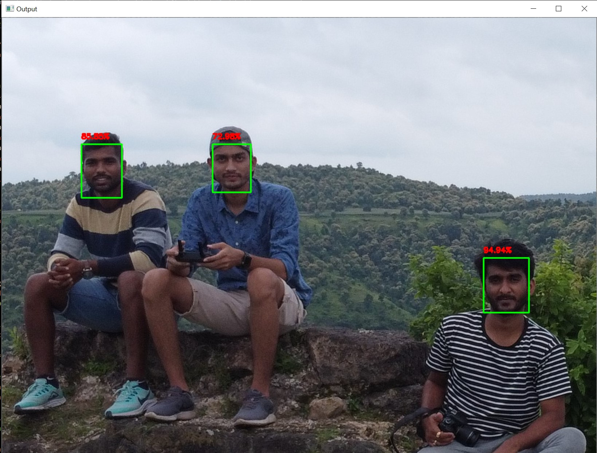

# Face-detection-with-OpenCV

Detecting faces using pre-trained deep learning face detector model shipped with the OpenCV library.

OpenCV's deep learning based face detector is based on the single shot detector (SSD) framework with a ResNet base network.

The usage details have been included in the code files.
To perform face detection on an image use 'detect_faces_image.py' and to perform face detection using webcam use 'detect_faces_video.py'

The '.ptototxt.txt' file defines the model architecture and '.caffemodel' file contains the weigths for the actual layers. 

Both files are required when using models trained using Caffe for deep learning.

Credits: Adrian Rosebrock's OpenCV tutorials
